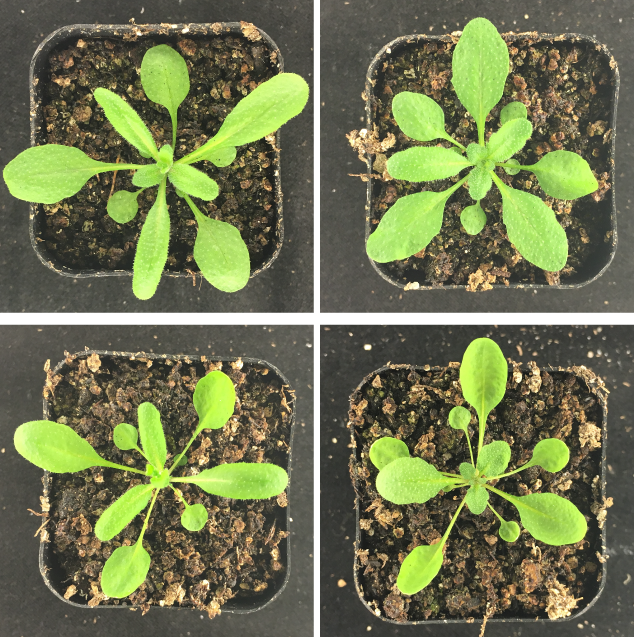
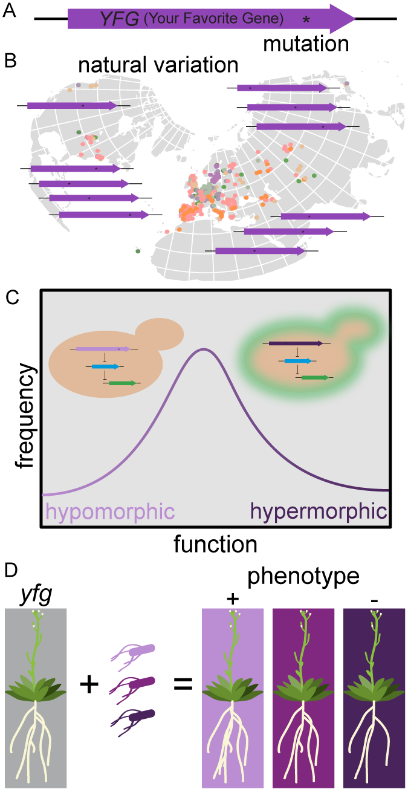
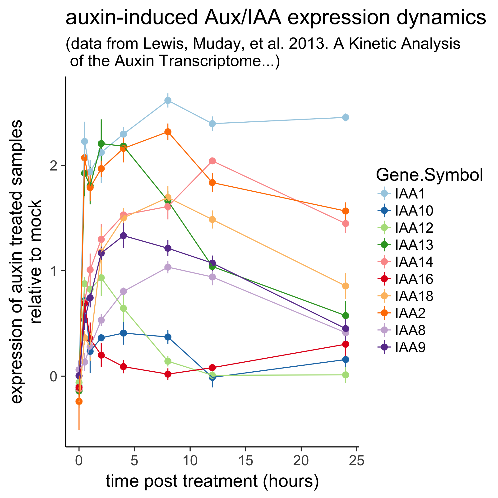
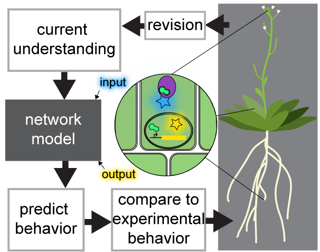

## Background
The ability to faithfully transfer information–both within an organism and from one generation to the next–is essential to life. As sessile organisms, plants must be especially adept in sensing and reacting to their surroundings. Perhaps as a result of this strong selective pressure, plant evolution is marked by frequent duplication of genes and entire biological circuits. While some duplicate genes retain their ancestral functions, others can drift and potentially adopt new functions. This process of duplication and divergence expedites adaptation by creating large and highly connected networks, allowing organisms to sample greater phenotypic space than simple circuits. 

## Grand Goal
My research focuses on understanding how signaling networks facilitate both plasticity and robustness in plant form and function, and how we can harness this knowledge to engineer proteins, signaling networks, and biosynthetic pathways for applications in agriculture and biotechnology. 

## Approach
My research integrates approaches from synthetic and computational biology, protein engineering, bioinformatics, molecular evolution, and genetics to quantify signaling dynamics, genetic interactions, and functional relationships in plant hormone signaling. 

## Aims

### Identify nodes of hormone-signaling networks conferring high evolvability by defining sequence-function-phenotype relationships

We will initially identify the genes and protein domains within the auxin signaling network for which sequence variation maximizes functional variation. Utilizing the [natural variation webtool](/projects/natVarWebtool/) we have developed, sequence variation in hormone-signaling gene networks is easily extracted from the 1001 Genomes dataset (A and B). The functional effects of this sequence variation will then be measured in [synthetic hormone response assays in yeast](https://dx.doi.org/10.1073/pnas.1324147111) (C).

The effects of this set of maximally functionally divergent variants on plant phenotye will then be quantified through backcrossing and segregation analysis, creation of recombinant inbred lines, transgensis, and/or the use of new CRISPR base-editors (D). This work will help identify genes and variants with high capacities for adaptive evolution to the selection criteria of plant breeders.

### Quantify dynamics and noise robustness contributed by different modes of feedback and crosstalk in hormone response circuits

Plant hormone signaling pathways contain numerous modes of feedback and crosstalk, which have potential to set signaling thresholds, control signaling dynamics, create memory of previous signals, and provide noise-robustness.

Adding feedback to synthetic hormone response circuits and describing these circuits using minimal mathematical models, will allow us to parameterize these models and efficiently explore the space of dynamic behaviors. This will provide a greater understanding of the importance of feedback to plant growth and development, and help us to engineer plant form and function.

### Develop hormone and protein biosensors to close the loop in developmental models

To translate much of the hypotheses generated from the proposed work in synthetic systems into in planta relevance will require the use of precision genome engineering tools, phenotyping at cell, tissue, and organism levels, and reporters and sensors of both signaling inputs and outputs. However, there is a lack of non-destructive methods for measuring hormone concentrations in planta.

I plan to utilize my protein engineering background to develop hormone biosensors based on hormone-induced stability of hormone-binding-protein-reporter fusions. I also plan to engineer high affinity binding proteins for auxin signalign proteins that can be fused to split reporter proteins to measure proteins and protein complexes using via bimolecular fluorescent complementation.

